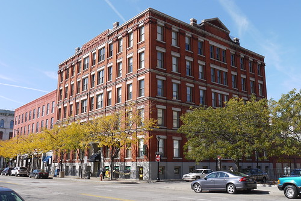
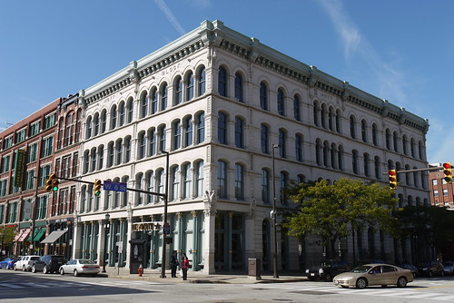
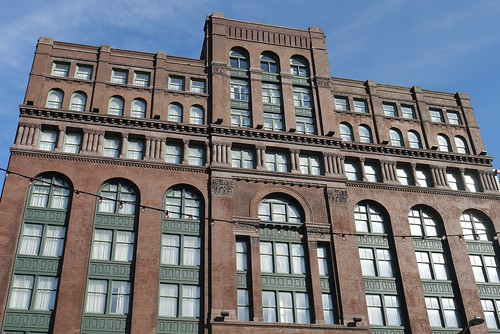
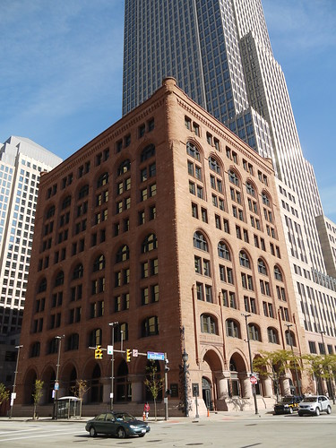

I visited Cleveland for the [2010 Reclaiming Vacant Properties conference](http://reclaimingvacantproperties.org/) and I was really impressed with the historic commercial architecture in the downtown area.

