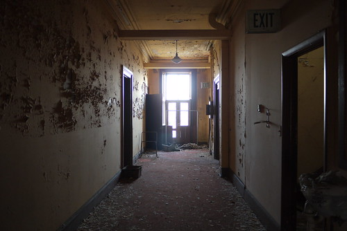
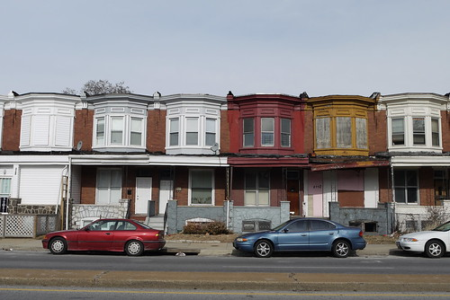
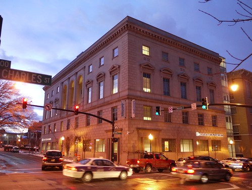
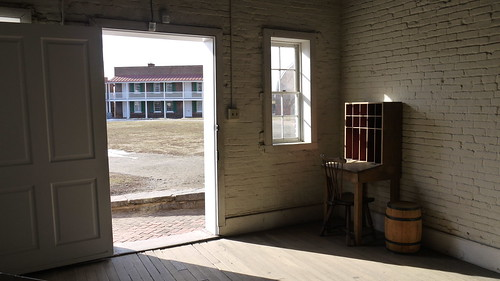

On New Year's Day, I decided to join a group of friends in doing a Fun A Day project in January. The idea of Fun A Day is to "pick a project (take a photograph, make the bed, draw a picture, bake a cake, etc), do it every day in January\*, then show your work the following month in a big group show." I tried to take a picture of a historic building every day, I managed 25 out of 31. A few favorites from the last month--

