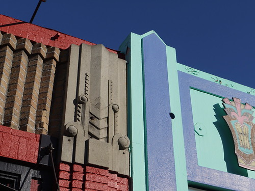
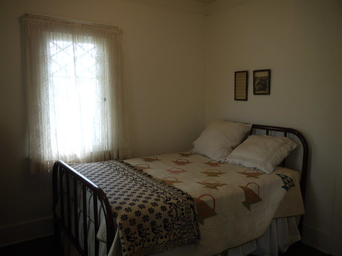

Art Deco architectural details in Balboa, California.

Richard Nixon was born in this bed. I'm a bit disappointed that I missed seeing [the new Watergate exhibit](http://www.nytimes.com/2011/04/01/us/01nixon.html)\-- we visited just a week before the opening.
