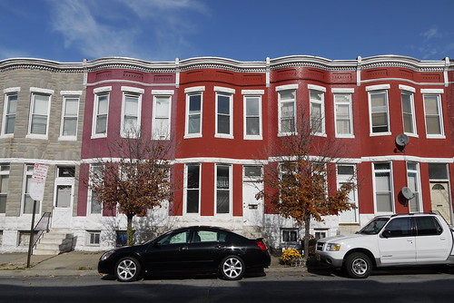
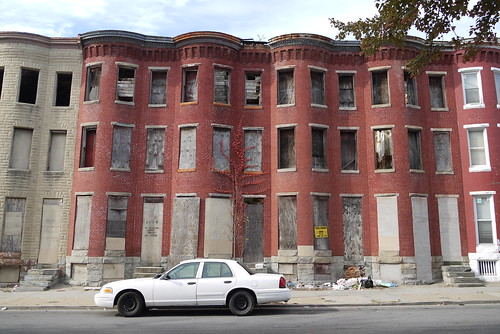
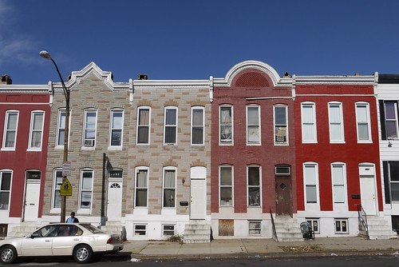

I took a thorough set of photos out in the Midtown Edmondson neighborhood of West Baltimore last fall and uploaded a few to Flickr. I'll likely share more of these through [Baltimore Heritage](http://www.flickr.com/photos/baltimoreheritage/) but I'm waiting to finish a National Register Historic District nomination for the neighborhood first.

