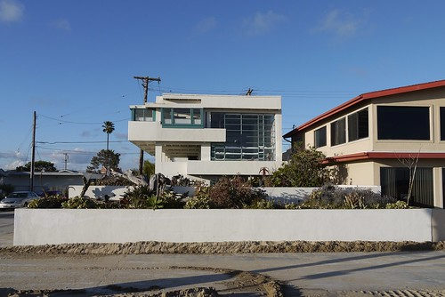
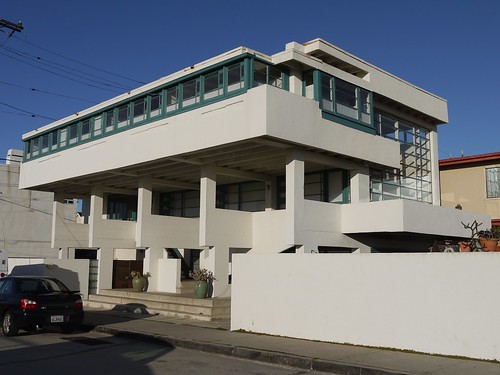
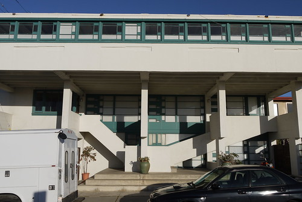

Designed by architect [Rudolf Schindler](http://en.wikipedia.org/wiki/Rudolf_Schindler) and completed in 1926, the [Lovell Beach House](http://en.wikipedia.org/wiki/Lovell_Beach_House) is one of the earliest examples of [International Style](http://en.wikipedia.org/wiki/International_style_(architecture)) residential architecture in the United States.

