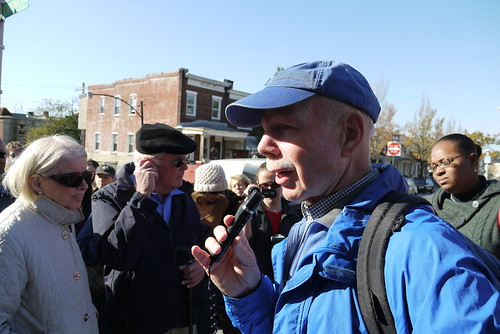
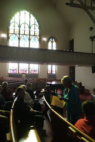

_This past October, I had the privilege of participating in a panel organized by Dr. Nicole King at the [American Studies Association](http://www.theasa.net/) Annual Meeting in Baltimore, along with Ms. Linda Shopes, Dr. Denise Meringolo and Dr. Ed Orser. The theme of the panel -- Baltimore City as Laboratory: Transformations of Urban Neighborhoods through Public History Programming -- helped frame a discussion on how our work  used "public history programming to address complex issues of identity and social justice in urban space" led by  Linda Shopes, an editor of the influential 1991 [The Baltimore Book: New Views of Local History](http://openlibrary.org/books/OL8668735M/The_Baltimore_Book). I wrote the following short piece highlighting our work with the Race and Place in Baltimore Neighborhoods project where I had the chance to work closely with both Linda and Ed on the development of tour programs and a website (still in development)._

Over the past two years with [Baltimore Heritage](http://www.baltimoreheritage.org/), I’ve worked on a handful of projects connecting historic preservation and neighborhood revitalization in the historic neighborhoods of West Baltimore. West Baltimore is not a likely place for this particular approach. I often encounter questions from both residents -- and, perhaps even more often, people who live outside these neighborhoods -- asking why bother with preserving or interpreting the history of neighborhoods and communities, whose struggles with abandonment, addiction, disinvestment and violence seem to overwhelm any other concerns? I can’t put this question aside quickly or easily so I’ll continue with this issue unresolved-- how can our shared heritage be used to build better neighborhoods and better lives for West Baltimore residents?

Baltimore Heritage is a nonprofit historic preservation advocacy organization established in 1960. We’re a small group, two and a half staff supported by membership and programs, with a history of energetic preservation advocacy. My own position began in fall of 2009 with support from the National Trust for Historic Preservation, to focus on African American heritage city-wide, matched by grants from the Baltimore Neighborhood Collaborative which required us to focus these outreach efforts in support transit-oriented community development in an area of West Baltimore neighborhoods proposed for the development of a new light rail route known as the [Red Line](http://www.baltimoreredline.com/).

Although West Baltimore is not exceptional within the city, or certainly when compared to neighborhoods in North Philadelphia, the east side of Cleveland, or the South Bronx, in some West Baltimore neighborhoods the scale of vacancy and abandonment is incredible, shocking to visitors and a tragedy for residents who live next door to collapsing rowhouses, burnt-out factories and brownfields. Neighborhoods like Harlem Park, Upton, and Midtown Edmondson can be characterized by concentrated poverty and limited access to fresh food.  Despite these challenges, however, you can find unique historic architecture on almost every block, from pre-Civil War rowhouses to midcentury modern civic and educational buildings. Historic green spaces, like Lafayette Square or Franklin Square, are still well loved and well used by many neighborhood residents.

Any explanation of this confusing landscape must draw on intersecting histories of racial segregation, housing discrimination, community development and urban renewal. Following these threads can help us connect the beginning of these neighborhoods--developed as affluent, European suburbs in the late 19th century to the emergence of Old West Baltimore as one of a handful of segregated black communities in the city at the beginning of the 20th century. We can continue through the rapid racial transition that transformed whole swaths of West Baltimore from white to black during the 1950s and 1960s (deftly chronicled by Dr. Ed Orser in _[Blockbusting in Baltimore: The Edmondson Village Story](http://www.amazon.com/Blockbusting-Baltimore-Edmondson-Village-Story/dp/0813109353)_) and the terrible mix of industrial job loss and urban renewal that gutted the heart of West Baltimore neighborhoods in the 1970s and 80s.

Our work in West Baltimore been a bit experimental, testing our hypothesis—heritage is an asset for West Baltimore’s community development—by exploring new ways to organize residents and reshape the perception of the historic built environment from a liability into an asset. Our experience so far has led us to a few ideas about what is important and what might work--

- We are dedicated to a usable past that seeks out histories of development, struggle, and organizing that offer tools to better understand contemporary concerns.
- We embrace difficult stories, recognizing the importance of stories around enslavement, civil rights, racism and urban renewal to shaping the history of these neighborhoods and continuing to engage residents and visitors at a visceral level.
- We don’t work alone. Our research and interpretation seeks to engage residents and other stakeholders in the interpretation of local history and the development of tours.

[Race and Place in Baltimore Neighborhoods](http://www.baltimoreheritage.org/education/race-and-place/) was one of our first large scale projects to address these themes of segregation and community development. With support from the Maryland Humanities Council and Free Fall Baltimore, we organized a series of four collaborative programs—a lecture on the local history of public housing and three walking tours in historically African American neighborhoods--Upton, Greater Rosemont, and Sharp Leadenhall--led by scholars from the Reginald F. Lewis Museum, UMBC and Towson University working in collaboration with resident-led neighborhood organizations. Together these programs aimed to stimulate an informed discussion about the historical experiences of residents and institutions in Baltimore’s historically segregated African American communities in relation to contemporary debates on historic preservation and community development.

 These three tours visited a diverse set of historic places, while considering issues from highway fights and anti-gentrification neighborhood organizing in South Baltimore through the flourishing of civil rights activism in [churches](http://www.flickr.com/photos/baltimoreheritage/5073353060/in/set-72157625144226222/) and businesses in the neighborhoods of Old West Baltimore. We visited [Thurgood Marshall's elementary school](http://www.flickr.com/photos/baltimoreheritage/5072751371/in/set-72157625144226222). We walked by the only Baltimore dollar house where a black resident displaced by eminent domain during the highway fight successfully returned to his home. In [church basements](http://www.flickr.com/photos/baltimoreheritage/5140844114/in/set-72157625144226222/), we discussed topics from the feasibility of rowhouse rehabs to the potential of transit-oriented development in the broader Baltimore region. In a single month, we engaged nearly 250 people, an audience that was notably more diverse in age and race than many of our more conventionally presented tour programs. This project affirmed our confidence in our new strategies for collaboration and interpretation, strategies that we continue to use in the development of new tours and publications focused on themes including the [Civil War history of West Baltimore](http://www.baltimoreheritage.org/2011/10/civil-war-150-west-baltimores-civil-war-history-by-bike/).

The results of these explorations remain inconclusive. We're still testing against the enduring challenges of decades of disinvestment along with our own limited capacity as a small nonprofit. I’m encouraged though by the idea that we’re not along. As we’ve searched for new ideas to apply to our own work, we’ve gotten to know a few of the organizations and individuals wrestling with these same concerns, testing their own approaches in local laboratories across the country. I’ll give you three examples--

- Andrew Hurley's work in St. Louis, documented in his recent book _[Beyond Preservation: Using Public History to Revitalize Inner Cities](http://www.amazon.com/Beyond-Preservation-History-Revitalize-Landscape/dp/1439902291/)_, offered historical and archeological research and interpretation to North St. Louis residents and organizations with the goal of supporting grassroots revitalization. Hurley observed, “Inner-city preservationists embarking on such a path can anticipate a  host of difficult decisions as they wrestle with the inevitable tension between community-building and economic-development goals.” - [p.31](http://books.google.com/books?id=RUKXeXVzl-cC&lpg=PA31&dq=Inner-city%20preservationists%20embarking%20on%20such%20a%20path%20can%20anticipate%20a%20%20host%20of%20difficult%20decisions%20as%20they%20wrestle%20with%20the%20inevitable%20tension%20between%20community-building%20and%20economic-development%20goals&pg=PA31#v=onepage&q&f=false)
- [Cliveden](http://cliveden1767.wordpress.com/), a 1760s mansion built for Revolutionary-era elite Benjamin Chew, had been a stodgy house museum through the early 2000s when they dedicated themselves to finding new relevance to their diverse, low-income neighborhood of Germantown, Philadelphia. In charting this new course, they decided to abandon the visitor, [redefining their mission](http://www.phillyhistory.org/blog/index.php/2010/11/cliveden-an-historic-germantown-mansion-redefines-its-mission/) to serve as “a catalyst for preserving and reusing historic buildings to sustain economic development for historic Northwest Philadelphia and beyond.”
- The [Los Angeles Conservancy](http://www.laconservancy.org/), supported by the same National Trust grant program as our work at Baltimore Heritage, hired a new organizer to greatly expand their outreach and advocacy in the segregated Latino communities of East LA, undertaking projects such as [“Save Wyvernwood,”](http://blog.preservationnation.org/2010/03/08/wyvernwood-este-lugar-es-importante-this-place-matters/) where they supported the efforts of a resident community in the 1939 Wyvernwood Garden Apartments to resist displacement and the demolition of their homes.

These examples are distinct, I know. At the same time, we’re all together wrestling with that same question I posed a few minutes ago. We’re not finding any easy answers but I do think we’re gaining confidence that public history and preservation scholars and professionals are right to ask this question.

Ned Kaufman, a long time director of historic preservation for the _Municipal Art Society_ of New York, offered an answer of sorts in _[Place, Race, and Story: essays on the past and future of historic preservation](http://books.google.com/books?id=CMbpbmgKqwMC)_, writing--

> "History offers a way to establish a presence within the public space of political and cultural discourse--and without presence one can hardly hope for leverage. History can't provide adequate housing, end discrimination or prevent redevelopment, but it can contribute to the debate that is necessary to achieving these goals." - [p.401](http://books.google.com/books?id=EutoMFJaMv8C&lpg=PA401&dq=History%20offers%20a%20way%20to%20establish%20a%20presence%20within%20the%20public%20space%20of%20political%20and%20cultural%20discourse--and%20without%20presence%20one%20can%20hardly%20hope%20for%20leverage.%20History%20can't%20provide%20adequate%20housing%2C%20end%20discrimination%20or%20prevent%20redevelopment%2C%20but%20it%20can&pg=PA401#v=onepage&q&f=false)
