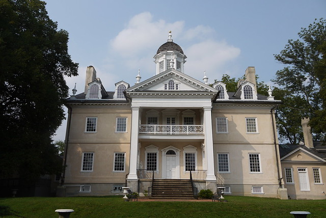
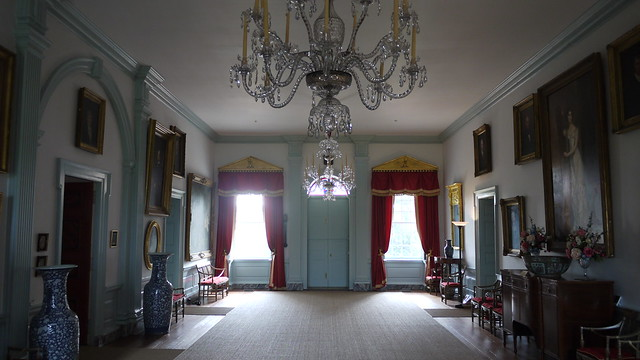
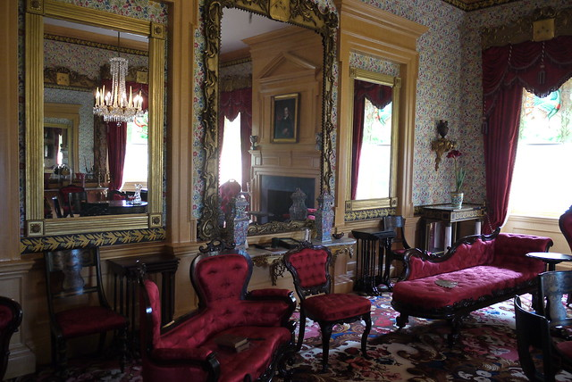
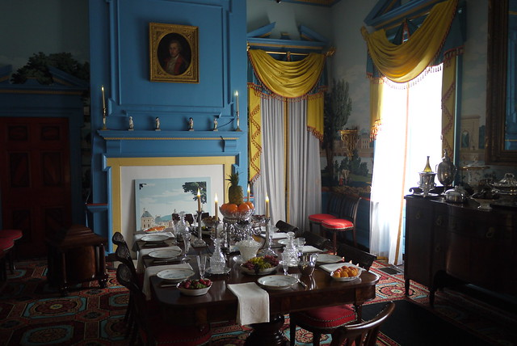
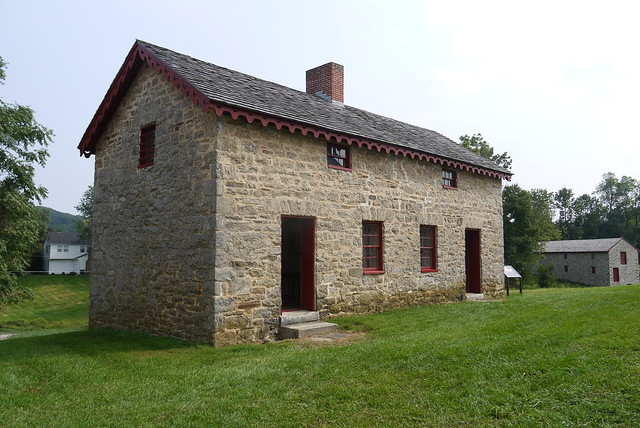

I visited [Hampton](http://www.nps.gov/hamp/index.htm) up near Towson for the first time back in early September and took a few nice shots. What these photos don't show, of course, is my wife and I chasing our 14-month old daughter around the museum until we ran out of steam and had to leave the tour early. Hope we can make it back again soon.

