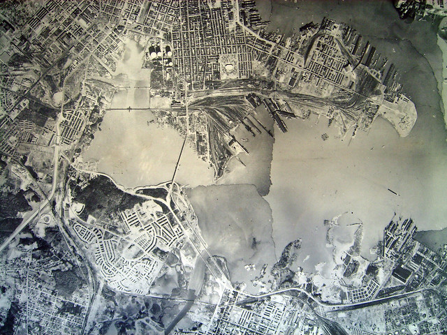
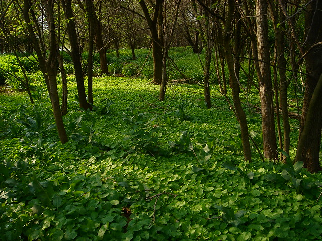

A few months back, I stumbled across a whole series of posts from 2008-2009 that Baltimore designer and educator Fred Scharmen wrote for a project he called the [Middle Branch Case Studies](http://w-as.net/#893343/Middle-Branch-Case-Studies). For folks outside of Baltimore, the Middle Branch is a shallow estuary of the Patapsco near the Baltimore City line. Fred's mix of informal ethnographic reflection and thoughtful research make great reading for anyone interested in a few of Baltimore's more marginal landscapes.

[Righthand Rule: South Baltimore No-Go Zones Part 1: Swann Park](http://765.blogspot.com/2007/09/righthand-rule-south-baltimore-no-go.html)

> After walking through the open gate of a closed park, along a path through a broken fence, to the edge of a crumbling bridge that leads to a shuttered power plant, you realize there's always another layer. The No-Go zones are nested like Russian dolls, but there's no deterrent quite as powerful as the feeling that you're being watched. I'll come back when there're no boats.

[Middle Branch Case Files: Reed Bird Island Park](http://765.blogspot.com/2008/04/middle-branch-case-files-reed-bird.html)

> Now Reed Bird Island is technically a city park, but only, as my collaborator Eric and I found out, because of a suggestion made by the Olmsted brothers (sons of Frederick Law) in 1904. They pointed out that erosion from development upstream at the Patapsco River was leading to the accumulation of mud flats here at the river's mouth. These were being occupied and used for dumping.
> 
> The Olmsteds, as part of their 1904 report on potential park spaces in Baltimore, suggested that the city get ahold of these islands, (their status was in doubt because they were basically new, free land) and cap them to form parks. They also pointed out that rerouting the new bridge to cross these things would increase their visibility and connection to the city. So after a few years, that's what happened.

[Soft Sites: Masonville Cove](http://765.blogspot.com/2008/12/soft-sites-masonville-cove.html)

> The Claw is conspicuous, jumping out of the gmaps aerial photo like a mutant appendage. Between the double pressures of development and industry, this much feral openspace on the waterfront is an anomaly, even for the spottily derelict Middle Branch. It is heavily vegetated, but walking the site, feeling the mossy bricks, ceramic powerline insulators and huge concrete blocks underfoot, one sees that this is really just a big pile, a ground made of stuff.

[Port Covington: The Ghost of the Masterplan in Tinkerer's Paradise](http://765.blogspot.com/2009/06/port-covington-ghost-of-masterplan-in.html)

> Then, as now, the spaces on the ground between these lines of connection and transfer were largely forgotten and undeveloped. In the 19th century, this area was the backyard and back door to the city of Baltimore, and like any backyard, this was a place for recreation and storage, comingled with trash and half-completed projects. The map above, part of a citywide topographic survey from 1895, shows rowing piers and resorts among the marshes, along with a dog pound, a guano pier, and a "night soil dump".

