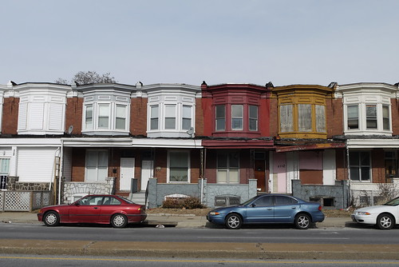

During the first month of 2011, I took [photos of old buildings](http://www.flickr.com/photos/elipousson/sets/72157625734011788) nearly every day (25/31 is not too bad!) as part of an event known as [Fun-A-Day](http://www.artclash.com/). For 2012, I wanted to get more folks in Baltimore to participate and to organize a small show for anyone who was interested. It didn't take long to set up [a Fun-A-Day Baltimore website](http://funadaybaltimore.wordpress.com/) and connect with a local artist who started a [Facebook event page.](https://www.facebook.com/events/314873355200904/) I've been kicking around a few local history ideas for a project I can tackle for January 2012 from a "walking tour"-a-day to a "building history"-a-day but I haven't settled on anything yet.

Any suggestions?

**Update**

My first Fun-A-Day project, a 12 page pamphlet on Orange County Modern architecture, is [now online](http://historicsprawl.wordpress.com/ocmodern/ "Orange County Modern").
