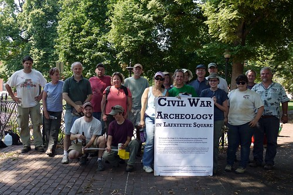
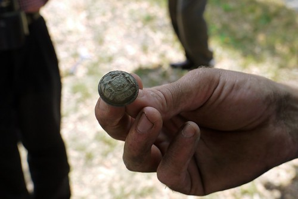
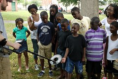

_Yesterday, I had the opportunity to present a paper at the [Society for Historical Archaeology](http://www.sha.org/) 2012 Annual Meeting about my work with Dr. Dave Gadsby on Civil War Archaeology in Lafayette Square. For more on Dave's past work, check out [Hampden Heritage](http://hampdenheritage.blogspot.com/) — a blog about his archaeological research with Dr. Bob Chidester and other collaborators in the Hampden neighborhood of Baltimore. Careful readers may notice some overlap with [my paper for the American Studies Association meeting](http://historicsprawl.wordpress.com/2011/11/29/race-and-place-in-baltimore-neighborhoods-at-the-american-studies-association-annual-meeting/ "Race and Place in Baltimore Neighborhoods at the American Studies Association Annual Meeting") back in October. I re-used a few passages that I thought worked well in that paper but I think there is enough new material in this one to make it a novel piece._

Over the past two years with Baltimore Heritage, I’ve worked to connect historic preservation and neighborhood revitalization in the historic neighborhoods of West Baltimore. Baltimore Heritage is a historic preservation advocacy nonprofit established in 1960. We’re a small group, two and a half staff supported by membership and programs. My own position began in fall of 2009 with support from the National Trust for Historic Preservation, to focus on African American heritage city-wide, support matched by grants from the Baltimore Neighborhood Collaborative requiring us to focus our efforts in support transit-oriented community development in an area of West Baltimore proposed for as the location of a new east-west light rail route known as the Red Line.

As part of this broader effort, I worked this past summer with Dr. David Gadsby, Brandon Bies and a great group of volunteers from the Archaeological Society of Maryland to conduct an archeological investigation of Lafayette Barracks—a Civil War camp and hospital located within the boundaries of Lafayette Square park, at the heart of an area known as Old West Baltimore. West Baltimore is not necessarily an obvious place to conduct an archeological investigation or to build connections between heritage and neighborhood revitalization. I often encounter questions from both residents — and, perhaps even more often, people who live outside these neighborhoods — asking why we should bother with preserving or interpreting the history of neighborhoods and communities, whose struggles with abandonment, addiction, disinvestment and violence seem to overwhelm any other concerns? While I can’t put this question aside, I can continue with a perhaps more optimistic thought – how can our shared heritage be used to build better neighborhoods and better lives for West Baltimore residents? Further, what is the place of public archeology in this effort?

Though such efforts are often minimized in favor of the higher priority on “removing blight” or attracting investment into downtown (and always constrained by limited funds), preservation and archeology in Baltimore have an urgent responsibility to connect cultural heritage to diverse communities in ways that go beyond interpreting the past or even highlighting the origins of the city's persistent inequalities, but to effectively empower residents in pursuit of neighborhood revitalization that respects their own histories. Our work with public archaeology in Lafayette Square began two years ago, when I first approached Dr. Gadsby to ask how we might be able to use archaeology to learn a bit more about the occupation of the park during the Civil War. My quick bar napkin sketch of the area must have been credible enough to convince Dave to come out on a site visit a few months later on a snowy January and then pass his enthusiasm along to Dr. Charles Hall from the Maryland Historical Trust a few months later. We applied for and received a Survey and Inventory grant from the [Archaeological Society of Maryland](http://www.marylandarcheology.org/) in late 2010 and scheduled our investigation for mid-summer 2011.

The project felt all the more urgent in the context of the national and local commemoration of the Civil War Sesquicentennial that seemed ready to take the stories of the B&O Railroad, the Pratt Street Riot, and wealthy, Confederate-sympathizing spies in Mount Vernon as the only stories worth telling. Such choices have consequences for who participates in the interpretation of Baltimore’s history and where that interpretation takes place, likely excluding segregated black, low-income neighborhoods like Lafayette Square. Writer and Baltimore native Ta-Nehisi Coates recently reflected on a similar point in [a recent NPR interview](http://www.npr.org/2011/12/08/143291199/black-scholar-of-the-civil-war-asks-whos-with-me) on how African Americans have been excluded from the interpretation of the Civil War through Lost Cause mythologies. Coates remarked that, “one of the most depressing things \[he\] found,” was when a tour guide at the Gettysburg Battlefield park told him, "'You can sit there for hours — and you can count on one hand the number of African-Americans that come into the battle park.’” In [_The Atlantic_ magazine](http://www.theatlantic.com/magazine/archive/2012/02/why-do-so-few-blacks-study-the-civil-war/8831/), Coates describes how the “country’s battlefields are marked with the enduring evidence” of the “tireless efforts” by Confederate descendants to present their own story of the Civil War—a story that, despite their defeat in the conflict, erased their ancestors complicity with the system of slavery that Confederate troops had fought for and died trying to preserve. Here in Baltimore, the monuments to Confederacy are one of the city’s most visible daily reminders of the war. Just this past summer, the Maryland’s United Daughters of the Confederacy held [a ceremony on Confederate Memorial Day at Baltimore’s Loudon Park Cemetery](http://baltimore.cbslocal.com/2011/06/04/maryland-group-marks-confederate-memorial-day/) to honor the 600 Confederate veterans buried there. No memorial exists to honor the free blacks who built Fort No. 1 on West Baltimore Street to protect the city (and encampments like Lafayette Barracks) from Confederate attack. No annual ceremony is held to recognize the hundreds of enslaved men who enlisted in the U.S. Colored troops, mustering at Camp Birney in West Baltimore’s Druid Hill Park.

Lafayette Barracks was located in Lafayette Square Park from 1861 through 1865, housing up to 1,000 soldiers at a time, and was just one camp within a broader ring of fortifications, hospitals and encampments that fed and sheltered soldiers moving in and out of Baltimore during the war. Our initial documentary research, by myself and my colleague Lauren Schiszik, turned up encouraging references that opened a window on the daily life of 1860s West Baltimore—stories of escaped slaves from the Eastern Shore sheltered by Union troops at the camp, stories of violence between soldiers and residents, stories that we hoped might be made all the more visceral through the use of archaeology. Public archaeology built on our continued efforts to explore and interpret complex histories of segregation, urban renewal and civil rights in West Baltimore and provided the basis to expand the visibility of our organizing effort with the Friends of West Baltimore Squares—a new partnership-based West Baltimore organizing and outreach effort we started last spring.

The investigation began on Friday, July 8 with our group of Archaeological Society of Maryland volunteers establishing a grid to guide the location of shovel test pits and the metal detector survey. We started a few shovel test pits that afternoon and began the metal detector survey working along the grid. On Saturday, we expanded the number of shovel test pits, working from east to west along the southern edge of the park where we believed camp activities would have been focused. We also opened up the two units--small square excavations--along the western edge of the park. Finally, on Sunday we concluded the excavation with additional shovel test pits and completing both units.

We recovered a range of 20th and 19th century artifacts including several items that are clearly associated with the Civil War occupation of the park. These latter artifacts include [tin buttons from the trousers or underwear of Union soldiers](http://www.flickr.com/photos/baltimoreheritage/5926078465/), a button from the dress jacket of a Maryland Union officer, and a small piece of lead shot. Other 19th century artifacts included a pipe stem, many [pieces of ceramic](http://www.flickr.com/photos/baltimoreheritage/5926089081/), fragments of [decorative cast-iron work](http://www.flickr.com/photos/baltimoreheritage/5916578229/), [brick](http://www.flickr.com/photos/baltimoreheritage/5926640038/) and coal. The presence of numerous [cut or wrought-iron nails](http://www.flickr.com/photos/baltimoreheritage/5916578785/) in the park is a clear indicator of the structures historically located in that area.

Over the long three day weekend, we had over 250 visitors to the site, including scores of neighborhood residents, local church members on Sunday, Baltimore Heritage members, and even the head of the Baltimore City Department of Planning. On Saturday alone, we had about 160 individuals participate in one of our five walking tours around the site and we gave away around 140 hotdogs to visitors and volunteers. We provided a range of interpretation including opportunities to talk with archeologists and volunteers, a 2005 outdoor exhibit produced by Baltimore Heritage on the social and architectural history of Lafayette Square, a temporary exhibit on the President Street Station set up by volunteers from the Baltimore Civil War Museum, and a brochure explaining the process of urban historical archaeology, the Civil War context of the site and the history of the community in the 20th century.

We’ve had several subsequent opportunities to continue extending the discussion around Lafayette Barracks—offering a special tour to a group of young people from the nearby Macedonia Baptist Church during the excavation and following up with the same group to present [a talk about the artifacts we recovered](http://www.westbaltimoresquares.org/?p=99); a presentation on the investigation to the Department of Recreation and Parks Advisory Board; tabling at Lafayette Square Block Party just a month after the dig with a box of artifacts in hand; presenting to local Civil War enthusiasts through a lecture series at the nearby Mt. Clare House Museum; and starting the planning for a follow-up presentation in the community once we have completed processing and analyzing the artifacts.

We have also connected the investigation to a range of other projects where we’re seeking to engage African American audiences around the Civil War Sesquicentennial, including [a walking tour](http://www.baltimoreheritage.org/2011/09/civil-war-150-slavery-and-historic-places-in-baltimore/) about the history of Frederick Douglass in Fell’s Point and [a lecture program](http://www.baltimoreheritage.org/2011/10/reminder-civil-war-150-slavery-historic-sites-lecture-tomorrow/) on how the National Trust for Historic Preservation is working to expand and improve the interpretation of enslavement at historic sites around the country. In November, we organized a [West Baltimore Civil War bike tour](http://www.baltimoreheritage.org/2011/10/civil-war-150-west-baltimores-civil-war-history-by-bike/) that connected visitors to encampments and significant historic places across the area with a role in the Civil War—Mt. Clare Mansion and Camp Carroll, the site of Lafayette Barracks, and the B&O Railroad Museum. This latter program had an additional advantage of building new relationships with local bike planners and advocates who are working to expand cycling infrastructure in West Baltimore communities.

This project was also an important accomplishment the Friends of West Baltimore Squares—a relatively new community organizing effort that we started in partnership with the [Parks & People Foundation](http://parksandpeople.org/) and a number of community organizations around Lafayette Square, nearby Harlem Park, Franklin Square, and Union Square to encourage the use and recognition of parks and heritage as important assets for community development. Through events and outreach—barbeques, volunteer events at local gardens and walking tours (highlighting history and sustainable storm water management)—we’ve grown a contact list of nearly 400 residents and stakeholders that are interested in staying engaged in West Baltimore neighborhoods. The strong turnout by residents and visitors for our archaeological investigation is both a reflection of our continued work to engage area residents and an important building block in establishing our credibility as a partner who can create valuable opportunities for local residents to meet neighbors and discuss both the past and the future of their communities.

Through these experiences we’ve settled on a set of guiding principles for our outreach work that clearly mirror the values of activist public archeology laid out by Dr. Gadsby and other practitioners within the field.

- We are dedicated to a usable past that seeks out histories of development, struggle, and organizing that offer tools to better understand contemporary concerns.
- We embrace difficult stories, recognizing the importance of stories around enslavement, civil rights, racism and urban renewal to shaping the history of these neighborhoods and continuing to engage residents and visitors at a visceral level.
- We don’t work alone. Our research and interpretation seeks to engage residents and other stakeholders in the interpretation of local history and the development of tours.

Even with modest expectations, it is challenging to evaluate the true effectiveness of these or any efforts that seek to use heritage to support neighborhood revitalization. We’re two and a half staff, a small grant here and there, up against decades of disinvestment and economic inequality. However, I agree with Dave writing in [Archaeology in Society, p.72](http://books.google.com/books?id=B3wDnRzVNvEC&lpg=PA72&ots=Fdo9fmPT4j&dq=lies%20in%20the%20need%20to%20convince%20local%20residents%20of%20the%20relevance%20of%20history%20and%20heritage%20for%20their%20lives&pg=PA72#v=onepage&q&f=false) that the "primary obstacle” for public archeology (and historic preservation) “lies in the need to convince local residents of the relevance of history and heritage for their lives.” Ned Kaufman, a long time director of historic preservation for the _Municipal Art Society_ of New York, offers his own support for this view in [_Place, Race, and Story: essays on the past and future of historic preservation_](http://books.google.com/books?id=CMbpbmgKqwMC), writing–

> “History offers a way to establish a presence within the public space of political and cultural discourse–and without presence one can hardly hope for leverage. History can’t provide adequate housing, end discrimination or prevent redevelopment, but it can contribute to the debate that is necessary to achieving these goals.”

With patience and many new partnerships, I hope we are starting to make the case this is true.
