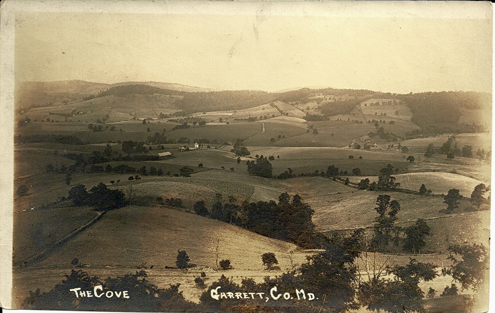

](http://19thcenturybaltimore.wordpress.com/2011/07/18/leo-beachy-the-cove-garrett-county-maryland/)

More tremendous photos, stereoviews, and cartes de visite from Baltimore and Maryland can be found on [Photographicus Baltimorensis](http://19thcenturybaltimore.wordpress.com/):

> This blog is a product of my preoccupation with Baltimore’s many early professional photographers and the thousands of portraits they took of Baltimoreans between the 1860s and the early 1920s, when Kodak’s advances made amateur photography a viable mass diversion.

It is nice when private collectors share their passion in a way that allows for broader public participation.
