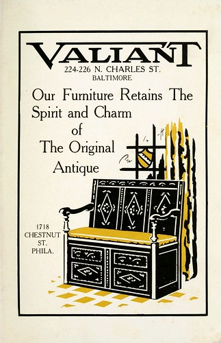
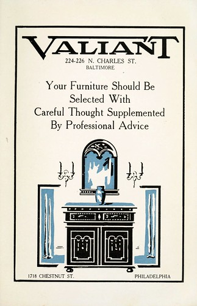
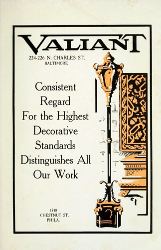
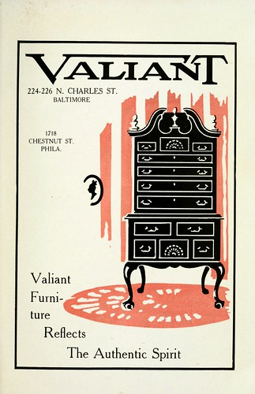

I turned up these [handsome furniture advertisements](http://www.flickr.com/photos/elipousson/sets/72157630037044022/) for the J.G. Valiant Furniture Company in the [Blue Book (1920)](http://archive.org/details/bluebook1920balt). A few images of Valiant's (long since demolished) showroom at 224-226 North Charles Street are available online from the [UMBC Hughes Company Collection](http://contentdm.ad.umbc.edu/cdm4/results.php?CISOOP1=exact&CISOBOX1=Furniture&CISOFIELD1=CISOSEARCHALL&CISOOP2=all&CISOBOX2=j.g.+valiant+company&CISOFIELD2=subjec&CISOROOT=/hughes&t=s).

 by eli.pousson, on Flickr")

 by eli.pousson, on Flickr")

 by eli.pousson, on Flickr")

 by eli.pousson, on Flickr")
