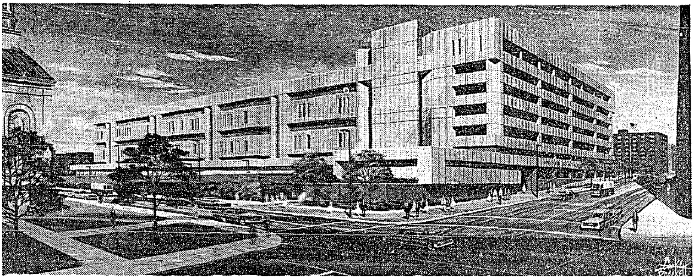

I have been working on a long post about State Center for weeks but I wanted to share a shorter piece in the interim. I found some time this evening to write up a few notes on the delightfully Brutalist Baltimore Post Office built in 1972 as part of the Shot Tower Industrial Park urban renewal project. I hope to expand on this in the future with more context on urban renewal in Jonestown.

## Baltimore Post Office (1972) - 900 East Fayette Street

With a floor area the size of sixteen football fields and a Brutalist façade composed of precast concrete panels, the Baltimore Post Office on East Fayette Street is a stark reminder of the scale and style of early 1970s urban renewal. The Post Office was designed in 1968 by Tatar & Kelly - a partnership of Seymour Tatar & W. Boulton Kelly - with Cochran, Stephenson & Donkervoet serving as associate architects. Further examples Tatar & Kelly can be found in modern buildings from the Enoch Pratt Free Library - Reisterstown Road Branch (1967), Steuart Hill Elementary School (1969) at Union Square, and the Baltimore County Public Library - Towson Branch (1974).

The builder, McCloskey-Leavell from Philadelphia, also developed the property under a build-lease scheme where the post office was built by a private enterprise, giving the federal government a lease and a later option to purchase. When the new building opened in 1972, the Post Office invested $5 million in new equipment with 4,000 employees. A 1971 account in _The Baltimore Sun_ heralded the development as an anchor for the Shot Tower Industrial Park -- a 24-acre area bounded by Colvin Street, Fayette Street, the Fallsway and Orleans Street.

, 10/19/1971](images/bge_47525a.jpg)
