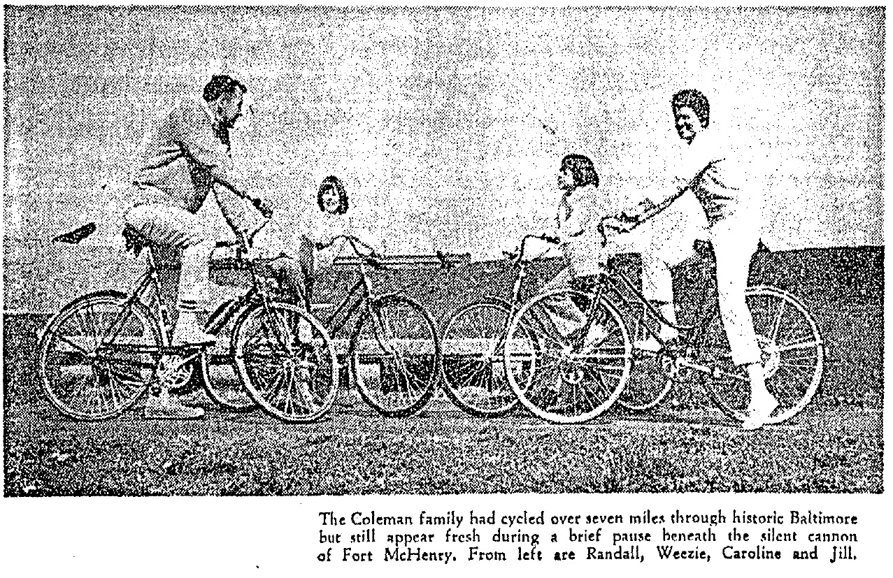
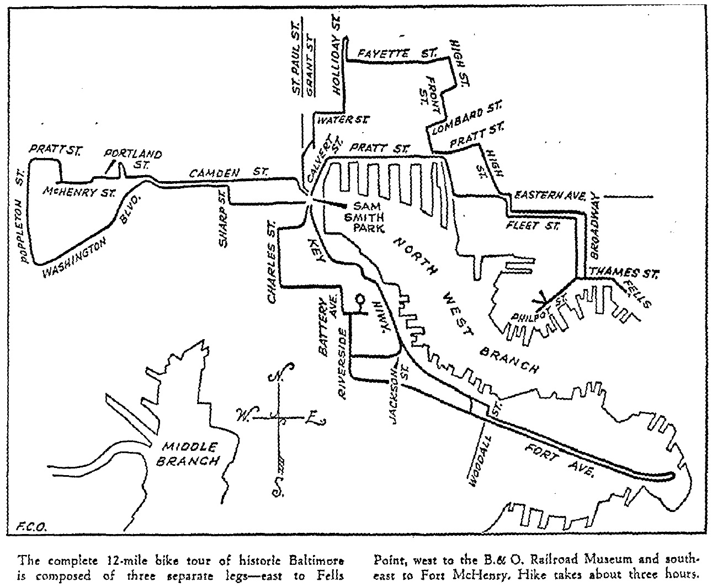

While researching the history of the Shot Tower Industrial Park this morning, I stumbled across a unexpected and delightful account of a historic bike tour from May 16, 1971. In "Bike Ride Through Historic Baltimore," writer Jack Dawson, who also worked as the sports director and evening news sports anchor for WMAR-TV, describes his morning bike ride with the Coleman family, across Downtown, Fell's Point, and South Baltimore to Fort McHenry. The group set off at set off at 8:15 am with Dawson riding a borrowed three-speed Schwinn, a bit unsteadily at first, explaining that he "hadn't ridden a bicycle for any distance for at least 15 years." Jill Coleman had mapped out the route for a "bike hike" organized by the Maryland Commission on Physical Fitness for the following Sunday. The full piece can be found in the ProQuest Historical Newspapers database through [the Pratt Library website](http://www.prattlibrary.org/research/database/?sbj=998) but I've pulled a few excerpts:

> Randall Coleman was riding his Raleigh in a circle on the parking lot without using his hands. His stepdaughters Caroline, 11, and 10-year-old Weezie (short for Louise), practiced tricks on theirs Schwinns. Mrs. Jill Coleman stood beside her station wagon, warning one of the girls to be careful.

> Merchants were opening their shops when we turned onto Broadway at 8:30. The neighborhood winos were already congregating on street corners. The driver of a foreign car stopped to let us pedal-pushers pass and flashed a wide smile and a peace sign.

> It was obvious Mrs. Coleman had mapped out a good route for the Maryland Commission on Physical Fitness bike hike from 9 a.m. to noon next Sunday, "If we can just get a good day and a turnout, then we'll be in clover," she said. "I've made the tour four times now and each time I've discovered new things. The more you explore, the more you find there is to explore."

Fortunately, the piece includes a map tracing the route. Many of the landmarks from the ride - the Peale Museum, Old Otterbein Church, the B & O Railroad Museum - remain much the same as in the early 1970s, while other places - notably the Inner Harbor- have been transformed beyond recognition. Now all I need to do is pick up a [vintage Raleigh](http://sheldonbrown.com/retroraleighs/) to give this a try myself.

