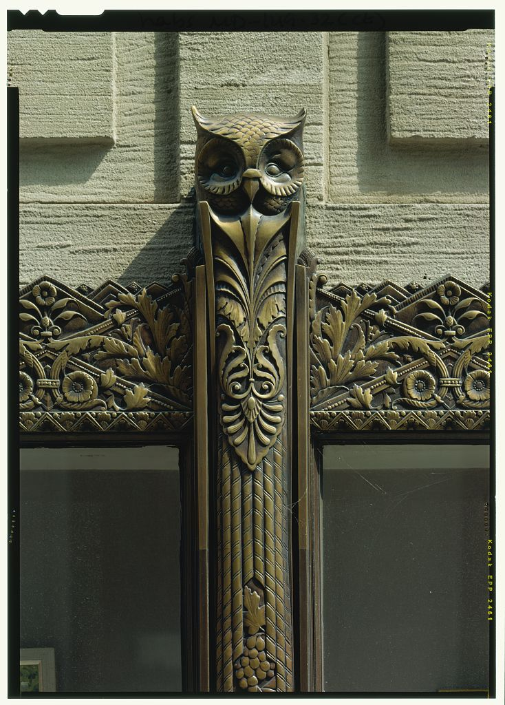

Similarly to Mid-century Modern architecture today, the appreciation of Art Deco architecture and design experienced a revival in the late 1970s. This revival included the successful effort of the Miami Design Preservation League (1976) to the listing of the [Miami Art Deco District](http://en.wikipedia.org/wiki/Miami_Beach_Architectural_District) on the National Register of Historic Places in 1979 and the spread of grassroots Art Deco preservation organizations in cities across the United States from the Art Deco Society of New York (1980) to the Detroit Area Art Deco Society (1986) and the Art Deco Society of the Palm Beaches (1987).

Baltimore had its own Art Deco Society and, although the organization has not survived through the present, interest in the topic resulted in the 1984 publication of an architectural survey of Baltimore Deco architecture. Around a year ago, I spent an hour or two paging through a copy at the office and transcribed the list of featured buildings into a table, now (thanks to a bit of fooling with Google Fusion Tables) included here as a map:

\[googlemaps https://maps.google.com/maps/ms?msa=0&msid=201251479367009811123.0004cacdf7bc9af8b96f2&ie=UTF8&t=p&source=embed&ll=39.321284,-76.616249&spn=0.12483,0.161705&z=12&output=embed&w=480&h=480\]

Enjoy as an informal (and certainly incomplete) tour of 1930s Baltimore architecture. I'm hoping to return to this topic again soon for more research and discussion.

**More Art Deco Societies**

-   Art Deco Society of California (1981) in San Francisco
-   Art Deco Society of Los Angeles (early 1980s)
-   Art Deco Society of Washington (early 1980s)
-   Chicago Art Deco Society (1981)
-   Art Deco Society of Boston (1989)
