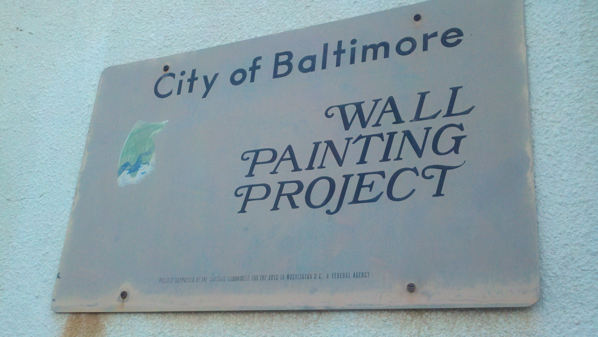
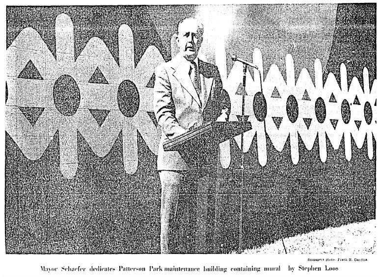
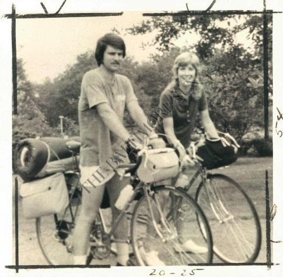
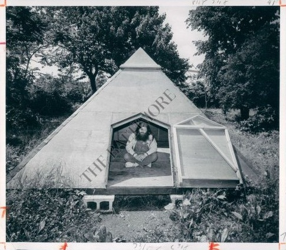

In September 1973, Mayor William Donald Schaefer led an effort to commission a set of ten murals funded by a \$10,000 grant from the National Endowment for the Arts. 85 artists submitted over 200 designs to the Department of Housing and Community Development (DHCD) for a competition reviewed by a panel of judges including: Jane Harrison Cone, a curator of the Baltimore Museum of Art, Serena Jordan of Northwest Baltimore Corporation, James Lewis, a professor of Morgan State and founder of the [James E. Lewis Museum of Art](http://www.jelmamuseum.org/), M. Jay Brodie of DHCD, Betty Wells, a local artist, and Joan Berska of the Mayor's office.

The panel selected ten winning designs and provided each artist with donated paint (Sears offered around 80 gallons), scaffolding, and a a \$1000 honorarium. By July 1974 nearly all ten of the murals were complete and Mayor William Donald Schaefer was pleased with how the colorful murals had brightened the streetscape, remarking on a bus tour of the murals in early October:

> "It's a psychological thing. I don't know if you've heard my lecture: If you go into a neighborhood and it's dull an drab, you're dull and drab. But if you go into a neighborhood and it's bright and clean you feel better. You expect big things to be done. But it's the little things that make the difference between living in a city and just existing."

Mayor William Donald Schaefer's bus tour was followed by a bike tour of a selection of eight of the ten artworks organized by the [Baltimore Bicycling Club](http://www.baltobikeclub.org/), Citizens For Bikeways and the Better Air Coalition to kick off Clean Air Week in Maryland.

[Bill Tashlick](http://articles.baltimoresun.com/2004-04-15/news/0404150040_1_bicycle-funeral-and-cremation-baltimore), who led the ride, was an architect with the Rouse Company before starting work with the Baltimore Department of Planning in 1971. As the chairman of a joint bicycle task force including government agencies and citizens groups, he worked  with the Maryland Department of Transportation on the design of bikeways across the state.

Tashlick's bike tour of Baltimore murals began at Roland and Lake Avenues near the city line at the top of one of the city's first designated bikeways. Gil Watson - who covered cycling for *The Baltimore Sun* in the 1970s and by the 1990s worked as the paper's Sunday editor -  joined the group of 23 cyclists on a chilly Sunday morning and provided an fascinating account that sketches out the 10 mile route:

------------------------------------------------------------------------

Down Roland avenue, down University to San Martin, Howard to North. First stop was North and Park avenue where, in huge, cheerful block letters the word "Baltimore" itself is immortalized. ... From Park we worked over to the 1800 block McCulloh, where a bold wall of yellow, green, orange and chartreuse (I think) rose from a small expanse of open grass. (All the murals are graced with a bit of open space.) Sunday early-risers eyed us as we eyed the wall.

Behind the Afro-American at Druid Hill avenue and Jasper street, a stylized pair of black dancers frozen on a white background was stop No. 3. No. 4 was the coffeeshop across from the Greyhound terminal on Howard. ... Moving out again, some of us still carrying coffee, we headed for the Police Stables on the Fallsway, where a big horizontal design plays perspective games with motorists headed north.

We then chugged up to the corner of Barclay and East Chase. Kids were playing basketball in front of another mural, this one a towering vertical in green and white. ... Two more stops, one at Aisquith and Lanvale, the other in the 1600 block North Calvert, and we ended our mural tour at what is surely one of the most intriguing - Robert Hieronymous's creation at Lanvale and St. Paul. Fantastically detailed, intricate and dominated by a one-eyed pyramid and an eagle, it has to be seen to be appreciated.

For that matter, they all have to be seen. The ride took roughly two hours (skipping one painting in Patterson Park facing Baltimore street and another at West Mulberry and Mount).

------------------------------------------------------------------------

\[googlemaps https://maps.google.com/maps/ms?msa=0&msid=201251479367009811123.0004d89bcc5d6a4e7aa06&ie=UTF8&t=p&ll=39.307074,-76.616764&spn=0.046489,0.085831&z=13&output=embed&w=500&h=350\]

This map involves a bit of conjecture as Gil Watson left out some details on their route towards the end of the ride. A few of the murals have survived the 30 years since but most are faded beyond any recognition or lost altogether. The mural painted for the police stables on the Fallsway still sports a small metal sign that appropriately credits funding for the "Wall Painting Project" to the NEA.  Look out for an update with a gallery of the ghosts of surviving murals later this summer or follow the route to see how many you can spot yourself.

### **Sources**

Banisky, Sandy. "Bringing Color, Design to Some of Baltimore's Blankest, Dullest Walls." *The Sun (1837-1987)*. October 12, 1974. [Link](http://search.proquest.com/hnpbaltimoresun/docview/538786973/abstract/13CFE3D829051E476BD/9?accountid=10750). "Other Murals, Other Artists." *The Sun (1837-1987)*. June 23, 1974. [Link](http://search.proquest.com/hnpbaltimoresun/docview/539029515/abstract/13CFE13C5ED3EC21243/1?accountid=10750). Watson, Gil. "Wheeling: A Bike Tour of Downtown." *The Sun (1837-1987)*. November 3, 1974. [Link](http://search.proquest.com/hnpbaltimoresun/docview/538756277/abstract/13CFDFAF27711A10C0A/25?accountid=10750).
