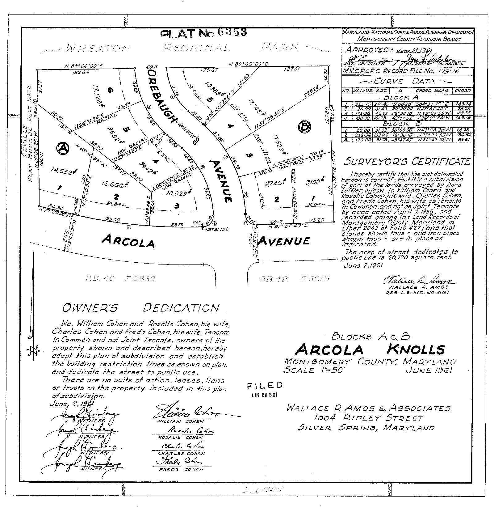
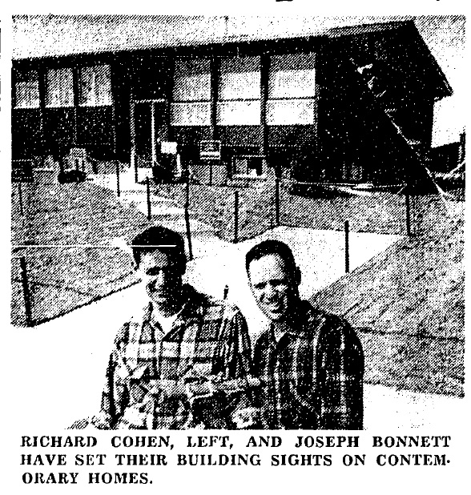
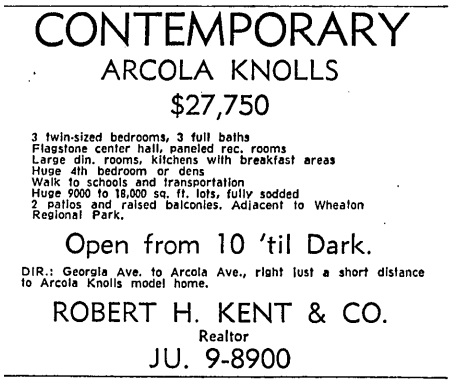

_I wrote this post back in 2010 but took it down after judging it a bit too personal and not my strongest writing. I recently received a comment from someone who grew up in Arcola Knolls looking for more information about the development so I wanted to re-post with a few minor edits from the original._

There are many modest vernacular examples of mid-century modern design in the Washington, DC suburbs that often go overlooked in favor of more iconic, innovative, or controversial buildings. My own appreciation for the vernacular modernism of Maryland's post-WWII subdivisions, gas stations, auto garages, and municipal buildings arrived gradually during the three years I lived in a 1962 split-level in the Arcola Knolls subdivision at the edge of Wheaton Regional Park. Although not quite as stylish as the homes in nearby [Hammond Wood](http://en.wikipedia.org/wiki/Hammond_Wood_Historic_District) designed by [Charles M. Goodman](http://en.wikipedia.org/wiki/Charles_Goodman), Arcola Knolls testifies to a fascinating period in regional history as rapid residential development encouraged local architects, developers, and home-buyers to experiment with contemporary architectural design.

Jo-Rich Developers, Inc. began work on Arcola Knolls in 1961 with the subdivision of the former agricultural property into 11 lots along Arcola and Orebaugh Avenues. Jo-Rich Developers, Inc. grew out of the friendship between builders Joseph Bonnett and Richard Cohen, just 27 and 21 years old when they began the project. Bonnett, a veteran and married father of two, planned to move his own family into the project upon completion while Cohen still lived with his parents in the North Portal Estates neighborhood of Washington, DC. Bonnett described the design of Arcola Knolls as "striking and daring in the contemporary style," featuring a "post and beam effect, exceptional window space and adaptation to indoor-outdoor living." Each house included four bedrooms and three baths, and was listed for sale by N.S. Bryer, Inc. for $28,950.

In April 1962, Jo-Rich Developers advertised the small development as "Silver Spring's Most Contemporary Community," emphasizing its proximity to churches, Northwood High School (1956), Wheaton Library (1962), and Wheaton Plaza (1959). With the rapid growth of Wheaton in the late 1950s and early 1960s, the adjoining Wheaton Park served as a pocket of wilderness, described in a _Washington Post_ headline: "Verdant Island Rises in the Suburbs." The _Post_ noted that when “asked how the county managed to save the plot from homebuilders," a Maryland National Capitol Parks and Planning official said simply, "'We got there first.'"

Architect John Arnold d'Epagnier (1913-1977) graduated from Catholic University with a B.Arch. in 1936 and by the 1950s maintained an office in the [recently transformed Cissel-Lee building](http://www.justupthepike.com/2009/09/renovation-creates-tension-between-old.html) in Silver Spring. Previous examples of his residential design included "The Presidential," a 1955 model home in Burnt Mills Estates, a “community of contemporary homes...to appeal to the modern-minded young families.” In addition to residential architecture, d'Epagnier designed a wide range of commercial structures and religious buildings including the [Ohev Sholom Talmud Torah](http://www.ostt.org/) synagogue at [16th & Jonquil Streets NW](http://maps.google.com/maps?hl=en&safe=off&q=16th+and+Jonquil+Streets+NW&ie=UTF8&hq=&hnear=16th+St+NW+%26+Jonquil+St+NW,+Washington,+District+of+Columbia,+20012&ll=38.983931,-77.036384&spn=0.000512,0.001321&t=h&z=20&layer=c&cbll=38.983846,-77.036286&panoid=UE2QN3CstvCpTsVzRgXniA&cbp=12,263.72,,0,-10.6), and [St. John the Baptist Parish](http://www.sjbsilverspring.org/parish/) in Colesville, a congregation to which he also belonged.

d'Epagnier's design for Arcola Knolls evidently proved popular as Jo-Rich sold all eleven homes within a few short months. My own grandparents purchased a home at the end of Orebaugh Avenue in 1962 and remained there for over forty years. My grandfather was a mechanical engineer working for the Department of the Navy and my Mom recalls that the modern architecture held a lot of appeal.

Unfortunately, Jo-Rich Development abandoned modern architecture on their few subsequent project, building low-slung Colonials in Montrose Park, Bethesda. Joseph Bonnett went with Dutch Colonial dwellings designed by architect [Morton Noble](http://communities.aia.org/sites/hdoaa/wiki/Wiki%20Pages/ahd1032729.aspx) for his late-1960s development, Hearthstone Square. In 1973, [Richard Cohen](http://www.willcocompanies.com/cohen.htm) went on to take over Wilco Companies - a commercial real estate development firm [started by his father Charles Cohen in the early 1960s](http://www.willcocompanies.com/history.htm) with investment from the sale of his two successful prior enterprises the Capitol Trash Company and the Normandy Cup Company. The firm remains a large  commercial real estate development and investment firm in the Washington, DC area.

Arcola Knolls, the project where Richard Cohen's development career began, where my grandparents bought a house and my mother grew up, remains a stand-out example of vernacular modernism in the Maryland suburbs.

### Sources

“California Contemporary Homes Open Next Week.” The Washington Post and Times Herald (1954-1959), May 8, 1955. Dessoff, Alan L. “Verdant Island Rises in Suburbs.” The Washington Post, Times Herald (1959-1973), July 7, 1960. Montgomery County Circuit Court Land Survey, Subdivision, and Condominium Plats. “Plat 6353, Arcola Knolls, Blocks A-B; William Cohen and Charles Cohen,” June 20, 1961. [Link](http://plato.mdarchives.state.md.us/msa/stagser/s1500/s1529/cfm/dsp_unit.cfm?county=mo&qualifier=S&series=1249&unit=14169). “Young Builders Go Contemporary.” The Washington Post, Times Herald (1959-1973), March 31, 1962.
