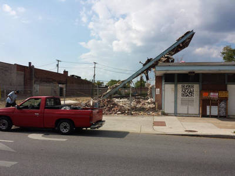

::: column-page
.](images/00340v.jpg)
:::

I've been driving up and down Harford Road pretty regularly over the past few weeks for our work on the [Herring Run Archaeology project](http://baltimoreheritage.org/project/herring-run-park-archeology/). Each time I return back down to Mount Vernon, this midcentury bank building at 2056 Harford Road just called out to me. Knowing nothing about the building, I went looking for some more details.

A quick search turned up a [*Baltimore Sun* account](https://historicsprawl.wordpress.com/?attachment_id=629) from September 4, 1956 - Branch Bank To Be Marked By New Look - turned up some key details on this former branch location for the Union Trust Bank:

> "A long-range program of modernization has resulted in the construction of eight new, modern bank buildings to replace old structures, plus extensive remodeling and enlargement of five additional branch offices in a ten-year period. There are now 25 Union Trust banking offices scattered through the Baltimore area. \[...\] **Designed by Smith & Veale**, local architects, the new building is to give the conception of a glass box. The steel frame is exposed and treated as part of the architecture of the building. Masonry masses are utilized to conceal the vault and other security facilities of the branch. \[...\] Ample hard-surfaced parking area on the rear of the lot is afforded for walk-in customers. A drive-up window beneath a canopy is available along the side of the building."

The firm of Smith & Veale was a partnership of local architects Thomas W. Smith and Graham Veale established shortly after the end of World War II. The firm designed scores of modern banks, libraries and schools. Veale, who [passed away in 1996](http://articles.baltimoresun.com/1996-01-19/news/1996019074_1_bethlehem-steel-owings-mills-mary-joan) at the age of 91, was a Philadelphia native who came to Baltimore as a teenager. Smith [died in 1998](http://articles.baltimoresun.com/1998-09-05/news/1998248050_1_gladys-mitchell-anne-county-sparks) at the age of 89. I recently profiled two other buildings designed by the firm - the [KAGRO Building](http://explore.baltimoreheritage.org/items/show/494) on North Avenue and the [North Point Branch](http://explore.baltimoreheritage.org/items/show/495) of the Baltimore County Public Library - as part of a nascent effort to expand our coverage of modernism in Explore Baltimore Heritage. I'd love to located the eight new Union Trust bank branches mentioned above and add them to our growing collection. If you're interested in modernist architecture in Baltimore, please join the [Baltimore Modernism Project](https://www.facebook.com/groups/712305302197735/) Facebook group to share ideas, research and writing on this theme.

The striking combination of the midcentury sign board and the cantilevered canopy above the bank's drive-through window was regrettably demolished in the fall of 2013 - not long after the deteriorated condition of the building was highlighted with a public artwork by [Wall Hunters Mural project](https://slumlordwatch.wordpress.com/2013/07/18/2058-2056-harford-road/). The bank building remains vacant.

::: column-margin

:::

When Google Streetview last captured Harford Road in October 2014, a "For Rent" advertised the building's availability and included a phone number t0 call for more information: 443-255-2028.

```{=html}
<iframe src="https://www.google.com/maps/embed?pb=!4v1687230257728!6m8!1m7!1sV5CPPfQ2SnFl-Dlx57hlow!2m2!1d39.3140284570084!2d-76.59822781308425!3f335.857597367327!4f-6.666520890043245!5f0.7820865974627469" width="600" height="450" style="border:0;" allowfullscreen="" loading="lazy" referrerpolicy="no-referrer-when-downgrade"></iframe>
```

