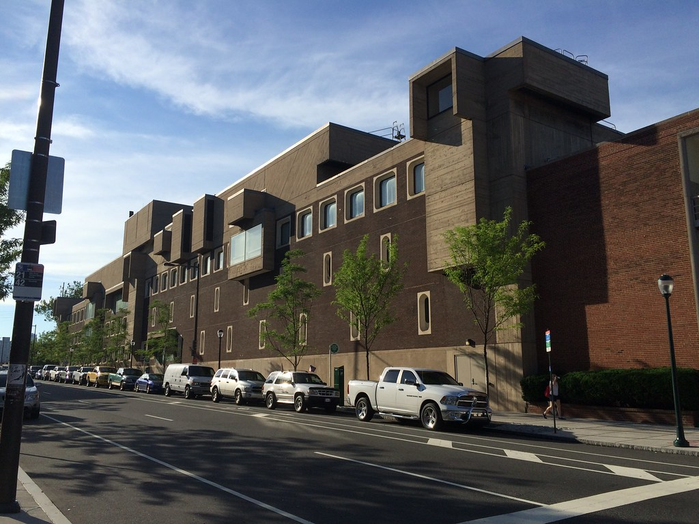
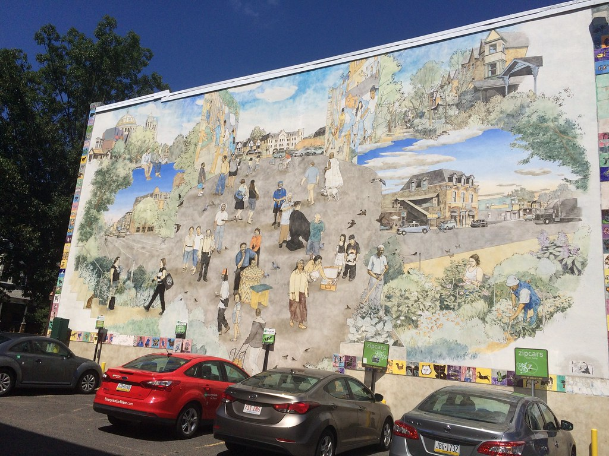
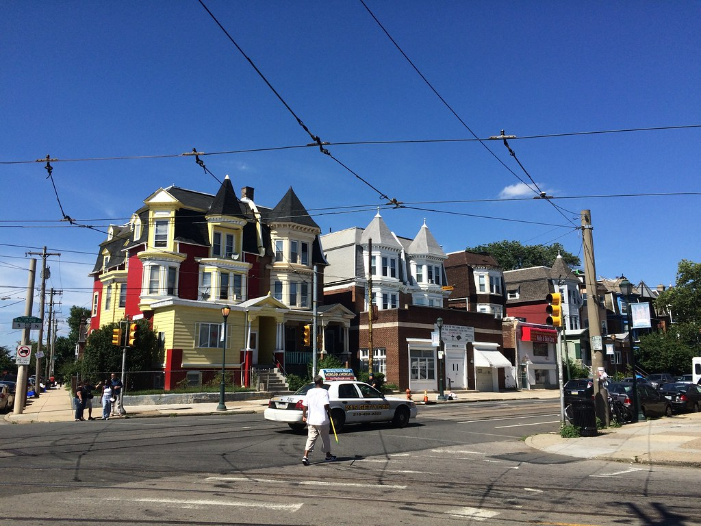
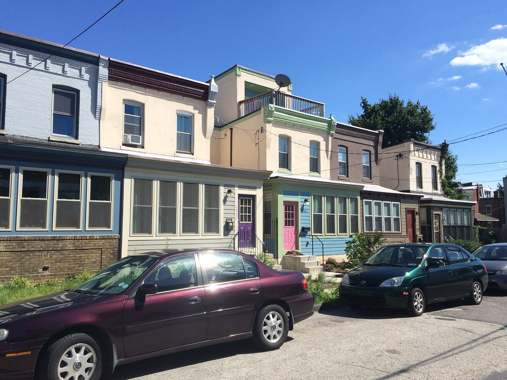
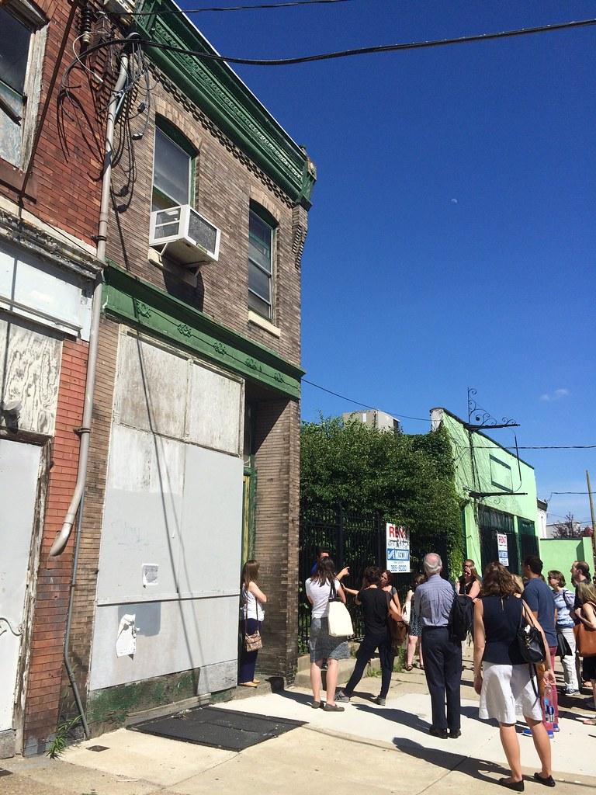
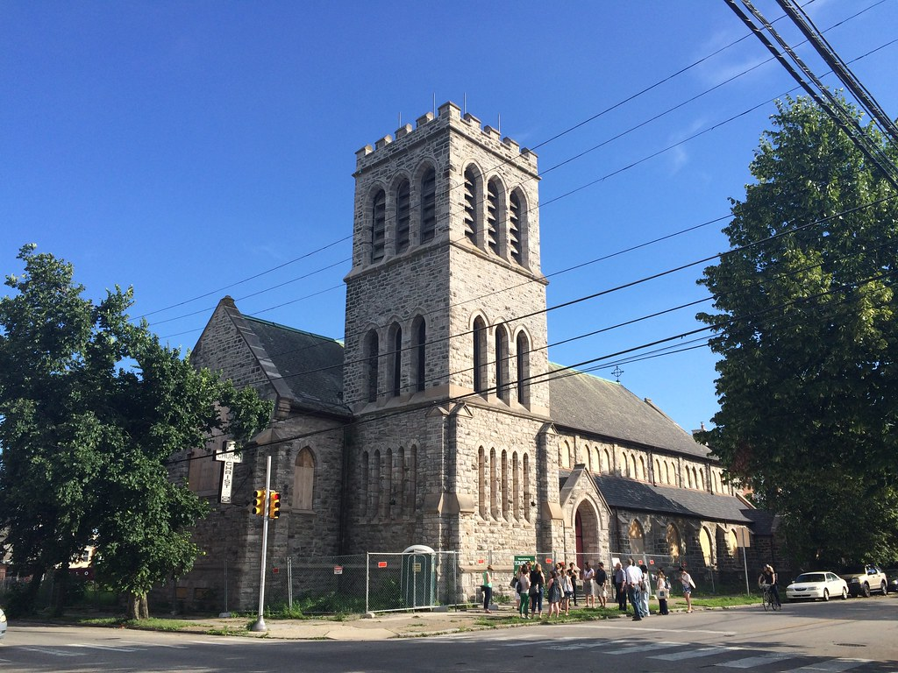
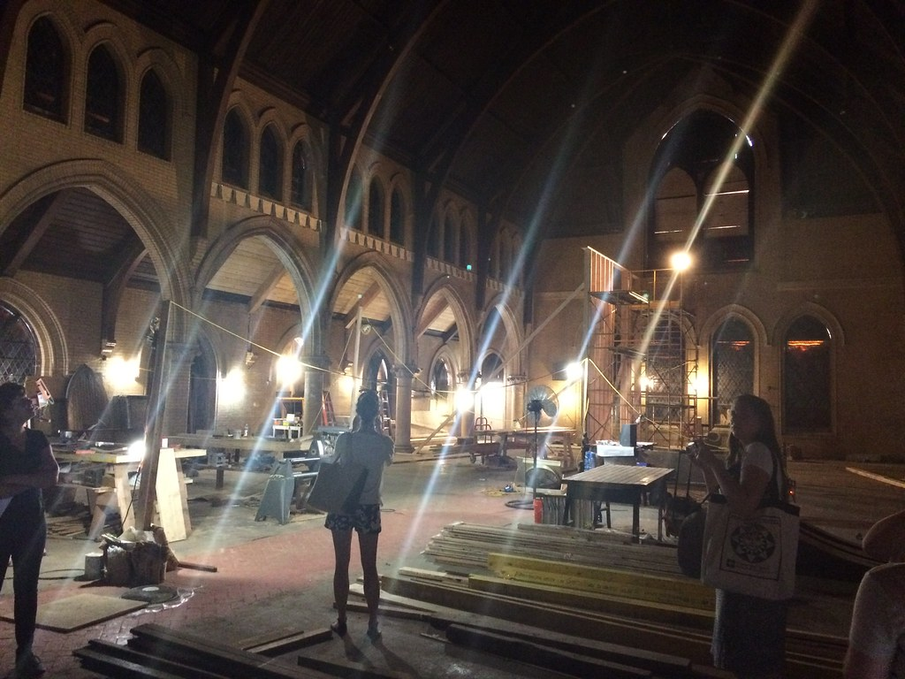

I spent a week in Philadelphia last month participating in a training on Historic Real Estate Finance from the National Development Council. The five-day course - organized by the National Trust for Historic Preservation with support from the 1776 Foundation - gave me an expanded understanding of how redevelopment projects are supported through a range of private and public investments.

One highlight of the week was a tour of the University City neighborhood (organized by Melissa Jest from the National Trust and led by local resident/developer Ryan Spack) where we learned about the reuse of a former bank building on Baltimore Avenue as the [Mariposa Food Co-op](https://www.mariposa.coop) and the [Project Rehab program](http://www.universitycity.org/project-rehab) of the University City District. We also got to peek inside the [Frank Furness](https://en.wikipedia.org/wiki/Frank_Furness) designed former Saint Peter's Church of Christ - a building that was [narrowly saved from demolition](http://www.phillymag.com/property/2015/04/15/frank-furness-church-philadelphia-preschools-conversion/) early this year.

I uploaded [a set of photographs](https://www.flickr.com/photos/elipousson/sets/72157655593211419) from the training and tour to Flickr and included a few favorites below.

